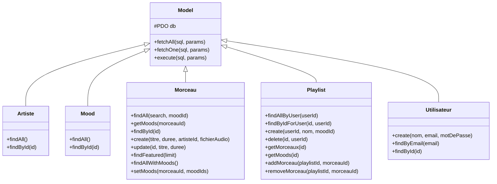
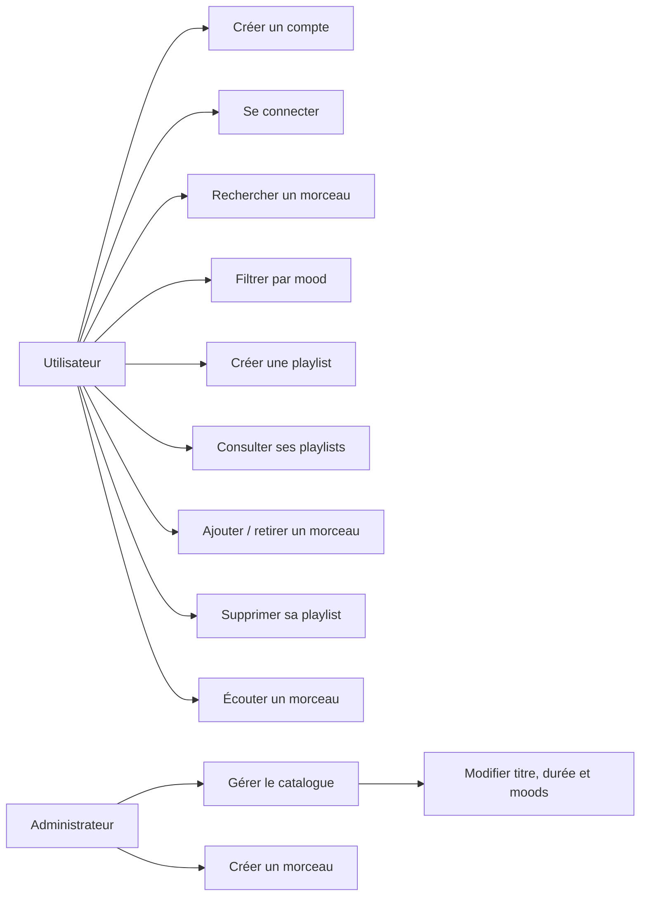
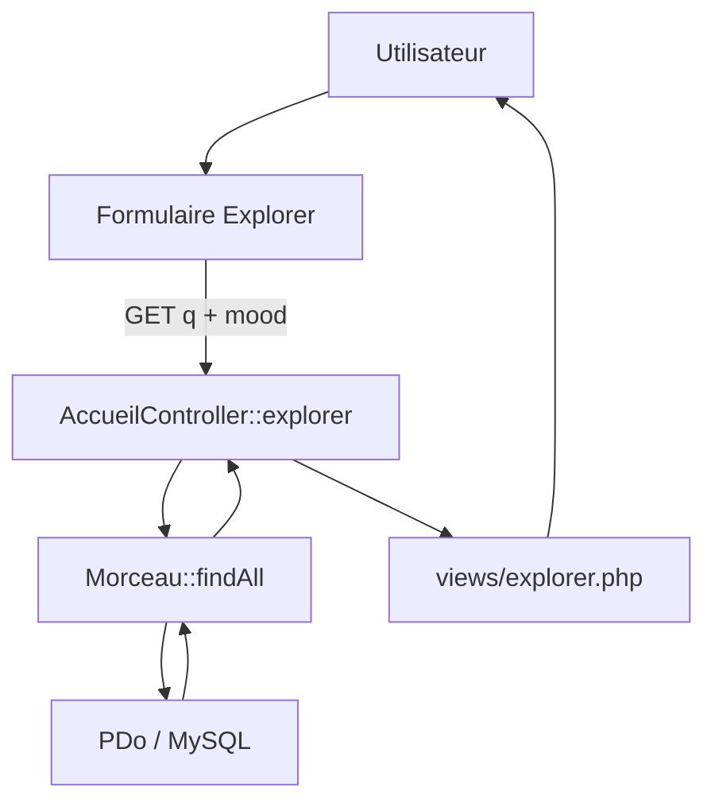
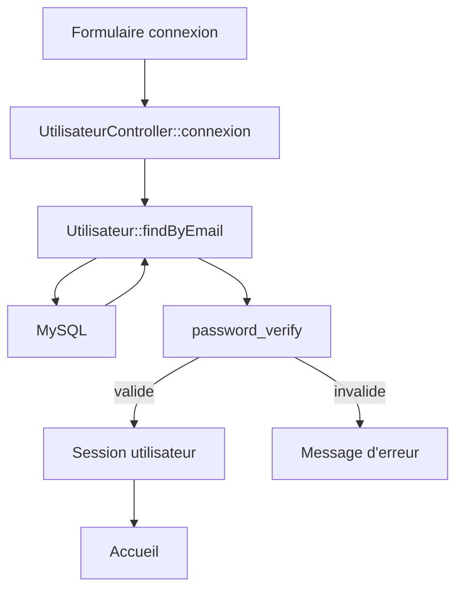
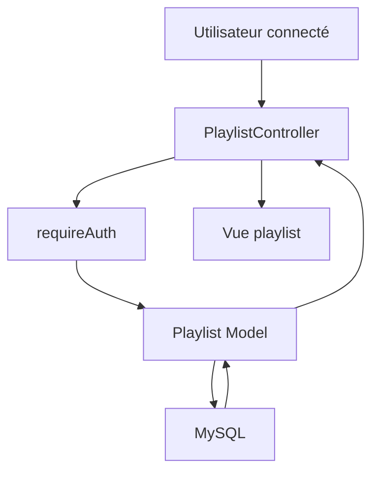

# Documentation orale et révision - Vibely

Ce document sert de support de révision pour l'oral du BTS SIO SLAM. Il décrit **le projet réellement présent dans le dépôt**, sans ajouter de fonctionnalités imaginaires.

---

# 1. Présenter Vibely en 30 secondes

> « Vibely est une application web musicale développée en PHP orienté objet avec une base MySQL. J'ai choisi une architecture MVC pour séparer l'accès aux données, le traitement des requêtes et l'affichage. Un utilisateur peut s'inscrire, se connecter, rechercher des morceaux par préfixe de titre, filtrer par mood et gérer ses playlists. Un rôle administrateur permet de gérer le catalogue. Les échanges avec MySQL passent par PDO et des requêtes préparées, et les mots de passe sont protégés avec `password_hash()` et `password_verify()`. »

---

# 2. Pourquoi cette architecture ?

## MVC

MVC signifie **Model - View - Controller**.

### Model
Le modèle s'occupe des données :
- connexion à la base via `Model` ;
- requêtes SQL ;
- récupération, création, modification et suppression des données.

Exemples : `Morceau`, `Playlist`, `Utilisateur`.

### View
La vue produit le HTML. Elle reçoit des variables préparées par le contrôleur et les affiche.

Exemple : `views/playlist/liste.php` reçoit `$playlists`.

### Controller
Le contrôleur reçoit la requête et orchestre le traitement :
1. récupérer les paramètres ;
2. vérifier les droits ;
3. valider les données ;
4. appeler un ou plusieurs modèles ;
5. transmettre les résultats à la vue.

### Router
Le routeur relie une URL à une méthode de contrôleur.

Exemple :

```text
index.php?route=playlist/liste
        ↓
PlaylistController
        ↓
liste()
```

## Pourquoi MVC ?

Le principal intérêt est la séparation des responsabilités. Une modification de l'affichage ne nécessite pas de réécrire les requêtes SQL, et inversement.

C'est aussi plus facile à expliquer et à maintenir qu'un seul gros fichier PHP mélangeant HTML, SQL et traitement des formulaires.

---

# 3. Pourquoi la POO ?

Les éléments du projet sont représentés par des classes :

```text
Model
├── Artiste
├── Mood
├── Morceau
├── Playlist
└── Utilisateur
```

Les modèles héritent de `Model`.

La classe `Model` centralise les opérations PDO communes :
- `fetchAll()` ;
- `fetchOne()` ;
- `execute()`.

Cela évite de recopier la même logique dans chaque modèle.

---

# 4. Arborescence et rôle de chaque dossier

## `config/`
Contient la configuration technique de la base de données.

### `Database.php`
Crée une connexion PDO unique avec `Database::getConnection()`.

Points importants :
- PDO ;
- MySQL ;
- UTF-8 `utf8mb4` ;
- erreurs PDO en exceptions ;
- résultats sous forme associative ;
- requêtes préparées natives avec `ATTR_EMULATE_PREPARES => false`.

---

## `controllers/`
Contient la logique de traitement des pages et actions utilisateur.

### `AccueilController.php`
- `index()` : récupère les morceaux mis en avant et les moods ;
- `explorer()` : récupère le texte de recherche, le mood sélectionné, les morceaux et les moods.

### `MorceauController.php`
- `requireAdmin()` : vérifie la session et le rôle administrateur ;
- `durationToSeconds()` : transforme `mm:ss` en secondes ;
- `admin()` : affiche et enregistre les modifications du catalogue ;
- `creer()` : crée un morceau.

### `PlaylistController.php`
- `requireAuth()` : vérifie que l'utilisateur est connecté ;
- `liste()` : récupère ses playlists ;
- `detail()` : récupère une playlist appartenant à l'utilisateur ;
- `creer()` : crée une playlist ;
- `supprimer()` : supprime une playlist de l'utilisateur connecté ;
- `ajouterMorceau()` : ajoute un morceau à une playlist appartenant à l'utilisateur ;
- `retirerMorceau()` : retire un morceau d'une playlist appartenant à l'utilisateur.

### `UtilisateurController.php`
- `connexion()` : authentifie l'utilisateur ;
- `inscription()` : crée un compte ;
- `deconnexion()` : détruit la session.

---

## `core/`
Contient les composants techniques génériques.

### `Router.php`
Lit `$_GET['route']`, sépare le contrôleur et la méthode, charge la classe correspondante puis appelle la méthode.

Exemple :

```text
?route=playlist/detail&id=3
        ↓
PlaylistController
        ↓
detail()
```

Le routeur nettoie également les noms de contrôleur et de méthode avec une expression régulière avant de les utiliser.

---

## `models/`
Contient les classes qui travaillent avec la base.

### `Model.php`
Classe abstraite commune.

- constructeur : récupère PDO ;
- `fetchAll()` : plusieurs lignes ;
- `fetchOne()` : une ligne ;
- `execute()` : INSERT / UPDATE / DELETE.

### `Artiste.php`
- `findAll()` ;
- `findById()`.

### `Mood.php`
- `findAll()` ;
- `findById()`.

### `Morceau.php`
- `findAll()` : recherche et filtrage ;
- `getMoods()` ;
- `findById()` ;
- `create()` ;
- `update()` ;
- `findFeatured()` ;
- `findAllWithMoods()` ;
- `setMoods()`.

### `Playlist.php`
- `findAllByUser()` ;
- `findByIdForUser()` ;
- `create()` ;
- `delete()` ;
- `getMorceaux()` ;
- `getMoods()` ;
- `addMorceau()` ;
- `removeMorceau()`.

### `Utilisateur.php`
- `create()` : hash du mot de passe puis INSERT ;
- `findByEmail()` ;
- `findById()`.

---

## `database/`
### `schema.sql`
Définit la base `vibely`, les tables, les clés primaires, les clés étrangères et quelques données initiales.

Tables :

```text
utilisateur
artiste
morceau
mood
morceau_mood
playlist
playlist_morceau
playlist_mood
```

Le fichier contient également le compte administrateur initial.

---

## `public/`
C'est la partie directement destinée au navigateur.

### `public/index.php`
Point d'entrée public : démarre la session et lance le routeur.

### `public/css/style.css`
Contient l'interface visuelle, les composants, la mise en page responsive et les styles des formulaires.

### `public/js/app.js`
Gère le lecteur audio côté navigateur.

La recherche n'est volontairement plus déclenchée par JavaScript à chaque frappe. Le formulaire HTML est soumis avec Entrée ou avec le bouton Filtrer.

---

## `views/`
Contient l'affichage.

### `views/layout/`
- `header.php` : navigation, barre de recherche, compte utilisateur ;
- `footer.php` : fermeture de la page et chargement du JavaScript.

### `views/morceau/`
- `admin.php` : catalogue administrateur ;
- `creer.php` : formulaire de création d'un morceau.

### `views/playlist/`
- `liste.php` : liste des playlists de l'utilisateur ;
- `detail.php` : détail d'une playlist et gestion des morceaux ;
- `creer.php` : formulaire de création.

### `views/utilisateur/`
- `connexion.php` ;
- `inscription.php`.

### `views/accueil.php`
Page d'accueil.

### `views/explorer.php`
Recherche et filtrage du catalogue.

---

# 5. Flux général d'une requête

```text
Navigateur
   │
   │ GET / POST
   ▼
index.php
   │
   ▼
public/index.php
   │
   ▼
Router::dispatch()
   │
   ├── choisit le contrôleur
   └── choisit la méthode
            │
            ▼
       Controller
            │
            ▼
          Model
            │
            ▼
       Database / PDO
            │
            ▼
          MySQL
            │
            ▼
          Model
            │
            ▼
       Controller
            │
            ▼
           View
            │
            ▼
          HTML
            │
            ▼
        Navigateur
```

---

# 6. Flux : connexion

```text
Utilisateur
   ↓
Formulaire connexion.php
   ↓ POST email + mot_de_passe
UtilisateurController::connexion()
   ↓
Utilisateur::findByEmail()
   ↓
SELECT utilisateur WHERE email = :email
   ↓
password_verify()
   ↓
Session $_SESSION['utilisateur']
   ↓
Redirection vers accueil
```

## Pourquoi `password_hash()` ?
Le mot de passe ne doit pas être stocké en clair.

Lors de l'inscription :

```php
password_hash($motDePasse, PASSWORD_DEFAULT)
```

Lors de la connexion :

```php
password_verify($motDePasse, $u['mot_de_passe'])
```

On ne « déchiffre » pas le hash. On vérifie si le mot de passe saisi correspond au hash.

---

# 7. Flux : recherche

La recherche est traitée par `AccueilController::explorer()`.

```text
Utilisateur tape "sa"
        ↓
Entrée ou bouton Filtrer
        ↓
GET ?route=accueil/explorer&q=sa
        ↓
AccueilController::explorer()
        ↓
Morceau::findAll("sa")
        ↓
LIKE :search_title
avec "sa%"
        ↓
MySQL
        ↓
Résultats
        ↓
explorer.php
```

Le `%` est placé **après** le texte : la recherche porte donc sur le début du titre.

Exemple :

```sql
m.titre LIKE 'sa%'
```

correspond à :

```text
Salut
Saphir
Sarah
```

mais pas à un titre qui commence par autre chose et contient seulement `sa` au milieu.

---

# 8. Flux : création d'une playlist

```text
Formulaire playlist/creer.php
        ↓ POST
PlaylistController::creer()
        ↓
requireAuth()
        ↓
Playlist::create()
        ↓
INSERT INTO playlist
        ↓
INSERT éventuel dans playlist_mood
        ↓
Redirection vers playlist/liste
```

La playlist reçoit l'identifiant de l'utilisateur connecté. Cela permet ensuite de vérifier sa propriété.

---

# 9. Protection des playlists

La méthode :

```php
findByIdForUser($id, $userId)
```

cherche une playlist avec **les deux conditions** :

```sql
WHERE p.id = :id
AND p.utilisateur_id = :user
```

Donc connaître l'ID d'une playlist ne suffit pas pour accéder à celle d'un autre utilisateur.

Même logique pour `delete()` :

```sql
DELETE FROM playlist
WHERE id = :id
AND utilisateur_id = :user
```

---

# 10. Flux : catalogue administrateur

```text
Connexion admin
      ↓
Session avec role = administrateur
      ↓
MorceauController::admin()
      ↓
requireAdmin()
      ↓
Affichage du catalogue
      ↓
Un seul <form>
      ↓
Plusieurs morceaux[id][...]
      ↓
Un seul bouton Enregistrer
      ↓ POST
Controller parcourt $_POST['morceaux']
      ↓
Morceau::update()
      ↓
Morceau::setMoods()
      ↓
Redirection
```

Ce choix permet de modifier plusieurs morceaux puis de tout envoyer avec une seule soumission.

---

# 11. Conversion de durée

L'utilisateur peut saisir une durée comme :

```text
03:24
```

Le contrôleur la convertit en secondes :

```text
3 × 60 + 24 = 204 secondes
```

La base stocke donc un entier, ce qui simplifie les calculs et l'affichage.

À l'affichage, le nombre de secondes est reconverti en `mm:ss`.

---

# 12. Base de données et relations

```text
UTILISATEUR
    │ 1
    │
    │ N
 PLAYLIST
    │
    ├──────────────< PLAYLIST_MORCEAU >────────────── MORCEAU
    │                                                     │
    │                                                     │ N
    │                                                     │
    │                                                     │ 1
    │                                                  ARTISTE
    │
    └──────────────< PLAYLIST_MOOD >────────────── MOOD

MORCEAU
    │
    └──────────────< MORCEAU_MOOD >────────────── MOOD
```

## Pourquoi des tables de liaison ?

Une playlist peut contenir plusieurs morceaux et un morceau peut appartenir à plusieurs playlists. C'est une relation **N:N**.

Même principe pour les moods :
- un morceau peut avoir plusieurs moods ;
- un mood peut correspondre à plusieurs morceaux.

Une table de liaison évite de répéter les mêmes informations.

---

# 13. Diagramme de classes



---

# 14. Diagramme de cas d'utilisation



---

# 15. Diagramme de flux de données : recherche



---

# 16. Diagramme de flux de données : connexion



---

# 17. Diagramme de flux de données : playlist



---

# 18. Pourquoi PDO ?

PDO permet de communiquer avec MySQL depuis PHP.

Le projet utilise des requêtes préparées :

```php
$statement = $this->db->prepare($sql);
$statement->execute($params);
```

Cela sépare la requête SQL des valeurs fournies par l'utilisateur et limite notamment les risques d'injection SQL.

---

# 19. Pourquoi `htmlspecialchars()` ?

Une donnée provenant de la base ou de l'utilisateur ne doit pas être injectée directement dans le HTML.

Exemple :

```php
<?= htmlspecialchars($morceau['titre']) ?>
```

Cela transforme les caractères HTML spéciaux afin qu'ils soient affichés comme du texte.

---

# 20. Pourquoi vérifier les droits côté serveur ?

Masquer un lien dans le HTML n'est pas une protection.

Par exemple, un utilisateur pourrait essayer directement :

```text
index.php?route=morceau/admin
```

Le contrôleur appelle donc `requireAdmin()` et vérifie réellement la session et le rôle.

Même principe pour les playlists : le contrôleur et le modèle vérifient l'utilisateur propriétaire.

---

# 21. Choix d'organisation des fichiers

Le but est qu'un fichier ait une responsabilité claire.

Exemple :

```text
SQL       → models/
Traitement → controllers/
HTML      → views/
Technique → core/ et config/
CSS/JS    → public/
```

Cela facilite :
- la maintenance ;
- la recherche d'une erreur ;
- le travail en équipe ;
- l'explication du projet à l'oral.

---

# 22. Questions classiques du jury

## Architecture

### 1. Pourquoi MVC ?
Pour séparer les responsabilités entre données, traitement et affichage.

### 2. Quel est le rôle du contrôleur ?
Il reçoit la requête, valide les données, vérifie les droits, appelle les modèles puis charge la vue.

### 3. Quel est le rôle du modèle ?
Il gère l'accès aux données et les requêtes SQL liées à une entité.

### 4. Quel est le rôle d'une vue ?
Afficher les données préparées par le contrôleur.

### 5. Quel est le rôle du routeur ?
Associer une route à un contrôleur et une méthode.

### 6. Pourquoi ne pas mettre le SQL dans les vues ?
Parce que cela mélangerait affichage et accès aux données et casserait la séparation MVC.

## POO

### 7. Pourquoi avoir une classe `Model` ?
Pour mutualiser la connexion PDO et les méthodes communes de requête.

### 8. Qu'est-ce que l'héritage ici ?
`Morceau`, `Playlist`, `Utilisateur`, `Mood` et `Artiste` héritent de `Model`.

### 9. Pourquoi `Model` est abstraite ?
Elle sert de classe commune et n'est pas une entité métier à instancier directement.

### 10. Qu'est-ce qu'une méthode ?
Une fonction définie dans une classe.

## BDD / SQL

### 11. Pourquoi une table `morceau_mood` ?
Parce que morceau et mood ont une relation plusieurs-à-plusieurs.

### 12. Pourquoi `playlist_morceau` ?
Pour représenter qu'une playlist contient plusieurs morceaux et qu'un morceau peut appartenir à plusieurs playlists.

### 13. À quoi sert une clé étrangère ?
À relier deux tables et garantir la cohérence des relations.

### 14. Pourquoi `ON DELETE CASCADE` ?
Pour supprimer automatiquement les lignes de liaison lorsqu'une entité liée est supprimée.

### 15. Pourquoi stocker la durée en secondes ?
Parce qu'un entier est simple à stocker et à manipuler. L'affichage reconvertit ensuite en `mm:ss`.

## Sécurité

### 16. Pourquoi `password_hash()` ?
Pour stocker un hash sécurisé plutôt que le mot de passe en clair.

### 17. Pourquoi `password_verify()` ?
Pour vérifier le mot de passe saisi sans avoir besoin de connaître le mot de passe original à partir du hash.

### 18. Pourquoi régénérer la session après connexion ?
Pour réduire le risque de fixation de session.

### 19. Pourquoi les requêtes préparées ?
Pour séparer les données de la requête SQL et réduire notamment le risque d'injection SQL.

### 20. Pourquoi `htmlspecialchars()` ?
Pour éviter qu'une donnée affichée soit interprétée comme du HTML.

### 21. Pourquoi le contrôle administrateur est côté serveur ?
Parce qu'une protection uniquement dans l'interface peut être contournée en appelant directement l'URL.

## Fonctionnel

### 22. Comment fonctionne la recherche ?
Le contrôleur récupère `q`, le modèle utilise `LIKE` avec `q . '%'`, puis la vue affiche les résultats.

### 23. Pourquoi la recherche ne se lance plus à chaque caractère ?
Pour éviter d'envoyer une requête au serveur à chaque frappe. Le formulaire est soumis avec Entrée ou le bouton Filtrer.

### 24. Comment fonctionne le catalogue ?
Toutes les lignes sont placées dans un seul formulaire sous la forme `morceaux[id][champ]`. Le contrôleur parcourt le tableau reçu et met à jour chaque morceau.

### 25. Comment empêcher l'accès aux playlists d'un autre utilisateur ?
Le modèle ajoute l'identifiant de l'utilisateur dans la requête SQL avec l'identifiant de la playlist.

### 26. Comment fonctionne la création d'un morceau ?
Le contrôleur récupère le titre, l'artiste, la durée, le fichier audio et les moods, puis appelle le modèle.

### 27. Comment le lecteur audio fonctionne-t-il ?
Le JavaScript crée un lecteur audio et récupère le chemin du fichier depuis l'attribut `data-audio` du bouton de lecture.

---

# 23. Explication d'une requête de recherche à l'oral

Si le jury demande « Montrez-moi concrètement comment fonctionne votre recherche », expliquer :

1. L'utilisateur saisit un texte dans `views/explorer.php`.
2. Le formulaire est soumis en GET.
3. `AccueilController::explorer()` récupère `$_GET['q']`.
4. Le contrôleur appelle `Morceau::findAll($recherche, $moodId)`.
5. Le modèle construit la condition `m.titre LIKE :search_title`.
6. La valeur envoyée est `$search . '%'`.
7. PDO prépare et exécute la requête.
8. Le résultat revient au contrôleur.
9. Le contrôleur charge `views/explorer.php` avec `$morceaux`.
10. La vue affiche les morceaux.

---

# 24. Explication d'une connexion à l'oral

1. L'utilisateur remplit le formulaire.
2. Le navigateur envoie un POST.
3. `UtilisateurController::connexion()` récupère email et mot de passe.
4. `Utilisateur::findByEmail()` recherche l'utilisateur.
5. `password_verify()` compare le mot de passe saisi avec le hash.
6. Si c'est valide, une session est créée.
7. Le contrôleur redirige vers l'accueil.
8. Le header utilise la session pour afficher le nom et les liens disponibles.

---

# 25. Explication d'une playlist à l'oral

Une playlist possède un `utilisateur_id`.

Lorsqu'un utilisateur consulte ses playlists :

```text
Session
 ↓
user_id
 ↓
PlaylistController
 ↓
Playlist::findAllByUser(user_id)
 ↓
SELECT ... WHERE utilisateur_id = :user
```

Cela garantit que la liste correspond à l'utilisateur connecté.

Lorsqu'il ajoute un morceau, la table `playlist_morceau` contient :

```text
playlist_id
morceau_id
```

La relation est donc stockée sans dupliquer les informations du morceau.

---

# 26. Ce que je peux dire sur les limites du projet

Si le jury demande une amélioration possible :

- ajouter une protection CSRF sur les formulaires POST ;
- ajouter des messages de validation plus précis ;
- gérer réellement l'upload de fichiers audio au lieu de saisir un chemin ;
- ajouter une modification du nom de playlist ;
- ajouter des favoris ou un historique d'écoute ;
- centraliser davantage certaines validations.

Il vaut mieux présenter ces éléments comme des **évolutions possibles**, pas comme des fonctionnalités actuellement présentes.

---

# 27. Réponse type à « Pourquoi avez-vous fait ce choix ? »

Structure simple à retenir :

> « J'ai choisi cette solution parce qu'elle répond au besoin tout en restant adaptée à la taille du projet. Elle sépare les responsabilités, reste compréhensible et facilite la maintenance. »

Puis donner l'exemple concret demandé par le jury.

---

# 28. Les 10 choses à connaître absolument avant l'oral

1. MVC : Model / View / Controller.
2. Le rôle du `Router`.
3. L'héritage de `Model`.
4. PDO et les requêtes préparées.
5. `password_hash()` / `password_verify()`.
6. Les sessions PHP.
7. Les relations N:N et les tables de liaison.
8. Le fonctionnement de la recherche avec `LIKE 'texte%'`.
9. Le contrôle d'accès administrateur et la propriété des playlists.
10. Le flux complet : **navigateur → routeur → contrôleur → modèle → BDD → modèle → contrôleur → vue → navigateur**.

---

# 29. Mini fiche anti-panique

Si une question surprend :

### « Pourquoi ce fichier est ici ? »
Identifier sa responsabilité.

### « Qui appelle cette méthode ? »
Remonter : vue/formulaire → contrôleur → modèle.

### « D'où vient cette variable ? »
Chercher la méthode du contrôleur qui fait `require` de la vue et repérer l'affectation.

### « Pourquoi cette requête est sécurisée ? »
Répondre : requête préparée PDO + paramètres séparés.

### « Pourquoi cette table existe ? »
Expliquer la relation qu'elle représente.

### « Et si l'utilisateur n'est pas connecté ? »
`requireAuth()` redirige vers la connexion.

### « Et si ce n'est pas l'administrateur ? »
`requireAdmin()` bloque l'accès côté serveur.

---

# 30. Conclusion à l'oral

> « Vibely m'a permis de mettre en pratique PHP orienté objet, MVC, PDO, SQL, les sessions, l'authentification et la gestion de relations entre plusieurs tables. Le choix principal a été de séparer clairement les responsabilités afin d'avoir un projet plus lisible et plus facile à maintenir. »
